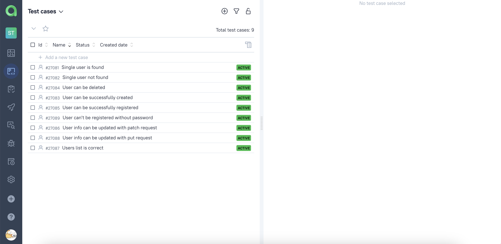

# Project with API automated tests for <a href="https://reqres.in/">Reqres</a>

# 📘Contents

- <a href="#tools">Technologies and tools</a>
- <a href="#cases">Test cases</a>
- <a href="#jenkins">Run tests with Jenkins</a>
- <a href="#console">Run tests from terminal</a>
- <a href="#allureReport">Allure reports</a>
- <a href="#allure">Integration with Allure TestOps</a>
- <a href="#telegram">Telegram notifications</a>

<a id="tools"></a>
## 🔧 Technologies and tools

<p align="center">
<a href="https://www.jetbrains.com/idea/"></a>
<a href="https://rest-assured.io/"></a>
<a href="https://www.java.com/"></a>
<a href="https://github.com/"></a>
<a href="https://junit.org/junit5/"></a>
<a href="https://gradle.org/"></a>
<a href="https://github.com/allure-framework/allure2"></a>
<a href="https://https://qameta.io/"></a>
<a href="https://www.jenkins.io/"></a>
<a href="https://https://telegram.org/"></a>
</p>

<a id="cases"></a>
## 💼 Test cases

- ✅ Get a specific user with get request
- ✅ Get a non-existing user with get request
- ✅ Get a list of users with get request
- ✅ Create a user with post request
- ✅ Delete a user with delete request
- ✅ Register a user with post request
- ✅ Register a user without password with post request
- ✅ Update user information with patch request
- ✅ Update user information with put request


<a id="jenkins"></a>
## </a> Run tests with <a target="_blank" href="https://jenkins.autotests.cloud/job/student-yakimchukyaana-qa_guru_21-reqres-api/"> Jenkins </a>

To run tests with Jenkins you need to click on the Build button. After running, you will see an allure report which appears near every run.

<p align="center">
<a href="https://jenkins.autotests.cloud/job/student-yakimchukyaana-qa_guru_21-reqres-api/"></a>
</p>

<a id="console"></a>
## 🚀 Run tests from terminal
CLI command:
```
gradle clean test
```

<a id="allureReport"></a>
##  </a> <a target="_blank" href="https://jenkins.autotests.cloud/job/student-yakimchukyaana-qa_guru_21-reqres-api/allure/"> Allure </a> reports

Allure report for tests looks like this: 
<p align="center">

</p>

### You can click on each test to find details:
- tags
- severity
- duration
- steps
- request
- response
- history

## 📎 Test example
<p align="center">

</p>

<a id="allure"></a>
## </a> Integration with  <a target="_blank" href="https://allure.autotests.cloud/project/3773/dashboards"> Allure TestOps</a>

There you can find all information about crucial things such as:

## 📈 Dashboards

<p align="center">

</p>

## 📝 Testcases
<p align="center">

</p>

## 🚤 Launches
<p align="center">

</p>

<a id="telegram"></a>
## </a> Telegram notifications
After each build test results are sent to a `Telegram` chat. It looks like this

<p align="center">

</p>